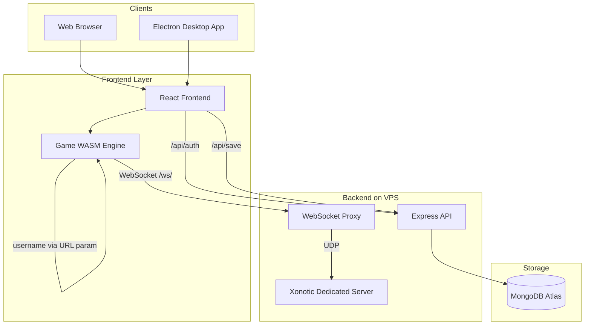
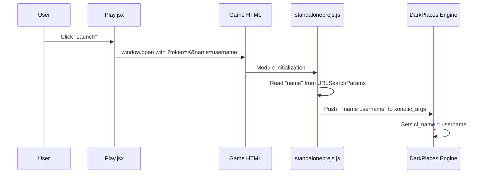

# PlayXonotic: Username Sync, Cloud Save, Desktop App, and Mouse Sensitivity Fix

## Architecture Overview



---

## 1. Mouse Sensitivity Fix (Bug)

**Root cause:** SDL2's Emscripten port scales `movementX`/`movementY` by `(internal_resolution / css_display_size)`. When the canvas CSS size (100vw x 100vh) is larger than the engine's internal rendering resolution, all mouse deltas are multiplied by a fraction < 1, making the mouse feel sluggish even at max sensitivity.

The scaling code is in the cached SDL port:

```314:335:xonotic-web-port/emscripten_cache/ports/sdl2/SDL-release-2.0.20/src/video/emscripten/SDL_emscriptenevents.c
// xscale = window_data->window->w / client_w;
// yscale = window_data->window->h / client_h;
// residualx += mouseEvent->movementX * xscale;  <-- this reduces input
```

**Two-part fix:**

- **Part A: Engine args** -- In [standaloneprejs.js](xonotic-web-port/source/darkplaces/wasm/standaloneprejs.js), increase default `m_yaw` and `m_pitch` from `0.022` to `0.05` (or similar) via launch args, giving a ~2.3x multiplier. This compensates for the SDL scaling without patching SDL itself.

Add to `xonotic_args`:

  ```javascript
  "+m_yaw", "0.05",
  "+m_pitch", "0.05"
  ```

- **Part B: SDL patch (optional, better fix)** -- Patch the cached SDL Emscripten handler to skip the `xscale`/`yscale` division when pointer lock is active (pointer-locked `movementX`/`movementY` are already in screen-space pixels and should not be rescaled). This file is at `emscripten_cache/ports/sdl2/.../SDL_emscriptenevents.c` line 324. Change the pointer-locked branch to use raw `movementX`/`movementY` without scaling.

---

## 2. Username Sync (DB username = in-game name)

**Flow:**



**Changes:**

- [Play.jsx](playxonotic/frontend/src/pages/Play.jsx) line 20: Append `&name=` to game URL:
  ```javascript
  const gameUrl = `/game/darkplaces-wasm.html?token=${encodeURIComponent(token)}&name=${encodeURIComponent(user.username)}`;
  ```

- [standaloneprejs.js](xonotic-web-port/source/darkplaces/wasm/standaloneprejs.js): Read the `name` param and inject `+name`:
  ```javascript
  var nameParam = parms.get("name");
  if (nameParam) {
    xonotic_args.push("+name", nameParam);
  }
  ```


---

## 3. Cloud Saving

**New MongoDB collection:** `saves` in the existing `xonotic` database on the same Atlas cluster.

**Schema ([playxonotic/backend/src/models/Save.js](playxonotic/backend/src/models/Save.js) -- new file):**

- `userId` (ObjectId, ref User, unique index)
- `configData` (Buffer -- gzipped tarball of `~/.xonotic/data/` config files)
- `updatedAt` (Date)
- `sizeBytes` (Number)

**New API routes ([playxonotic/backend/src/routes/save.js](playxonotic/backend/src/routes/save.js) -- new file):**

- `GET /api/save` -- returns user's save data (auth required)
- `POST /api/save` -- upload save data, max 5 MB (auth required)

**Mount in [backend/src/index.js](playxonotic/backend/src/index.js):**

```javascript
const saveRoutes = require('./routes/save');
app.use('/api/save', auth, saveRoutes);
```

**Game-side integration in [standaloneprejs.js](xonotic-web-port/source/darkplaces/wasm/standaloneprejs.js):**

- On load: If `token` URL param exists, fetch `GET /api/save` and write the config files into the Emscripten VFS before engine start (as a run dependency).
- On save: Hook `beforeunload` and `visibilitychange` events. Read config files from VFS (`/home/web_user/.xonotic/data/config.cfg`, etc.), package them, and POST to `/api/save`.

**Nginx:** Add `location /api/save` routing to backend (already covered by existing `/api/` block).

---

## 4. Electron Desktop App

**New directory: `playxonotic/desktop/`**

Structure:

```
desktop/
  package.json
  main.js           -- Electron main process
  preload.js        -- Context bridge for IPC
  forge.config.js   -- Electron Forge config for portable builds
```

**How it works:**

- Electron loads the React frontend (either from local build files or from `https://playxonotic.com`)
- Game WASM runs inside Electron's Chromium (same as browser, but no cross-origin issues)
- Auth tokens stored in Electron's `safeStorage` instead of localStorage
- Game assets bundled locally in `resources/game/` so no 1 GB download on first launch
- Builds as portable (no installer required): `.zip` for Windows, `.AppImage` for Linux, `.dmg` for macOS

**Key files:**

- **`main.js`**: Creates BrowserWindow, serves local frontend `dist/`, proxies API calls to `https://playxonotic.com/api/`
- **`package.json`**: Dependencies (`electron`, `@electron-forge/cli`), scripts (`start`, `make`)
- **`forge.config.js`**: Configure `zip` maker for portable builds on all platforms

**Build and distribution:**

```bash
cd playxonotic/desktop
npm install
npm run make   # produces portable builds in out/
```

---

## 5. Deploy Script Updates

Update [deploy.sh](playxonotic/deploy/deploy.sh) to also upload cloud save route files and rebuild the game WASM with the sensitivity fix.

---

## Summary of files to create/modify

**New files:**

- `playxonotic/backend/src/models/Save.js` -- Save schema
- `playxonotic/backend/src/routes/save.js` -- Cloud save API
- `playxonotic/desktop/package.json` -- Electron project
- `playxonotic/desktop/main.js` -- Electron main process
- `playxonotic/desktop/preload.js` -- Context bridge
- `playxonotic/desktop/forge.config.js` -- Build config

**Modified files:**

- `xonotic-web-port/source/darkplaces/wasm/standaloneprejs.js` -- Mouse fix args, username sync, cloud save hooks
- `playxonotic/frontend/src/pages/Play.jsx` -- Pass username in game URL
- `playxonotic/backend/src/index.js` -- Mount save routes
- `playxonotic/deploy/deploy.sh` -- Include new files in deployment
- (Optional) `emscripten_cache/.../SDL_emscriptenevents.c` -- SDL mouse scaling patch

**Rebuild required:** WASM game binary (after standaloneprejs.js changes)