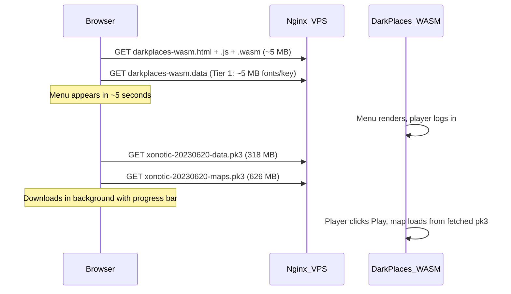

# Streaming / Lazy Loading Optimization for PlayXonotic

## Problem

Currently, the entire game data (~949 MB) is bundled into a single `darkplaces-wasm.data` file via `--preload-file`. The browser must download all of it before the game can start, causing a ~3.5 min blank loading screen even on decent connections.

## Strategy

Split the game data into two tiers:

- **Tier 1 (preloaded, ~5 MB):** Fonts + xoncompat + key file -- enough for the menu to appear
- **Tier 2 (lazy-loaded, ~944 MB):** Core data, maps -- fetched in the background after the menu loads, or on-demand when a map is selected



## Implementation

### Step 1: Restructure preloaded data

In [makefile.inc](xonotic-web-port/source/darkplaces/makefile.inc) (lines 274-277), replace the current `--preload-file` directives:

**Current** (preloads everything):

```
--preload-file /home/barramee27/antigravity/xonotic-data-trimmed@/xonotic/data
--preload-file .../key_0.d0pk@/xonotic/key_0.d0pk
```

**New** (preload only Tier 1 -- fonts, xoncompat, key):

```
--preload-file .../font-unifont-20230620.pk3@/xonotic/data/font-unifont-20230620.pk3
--preload-file .../font-xolonium-20230620.pk3@/xonotic/data/font-xolonium-20230620.pk3
--preload-file .../xonotic-20230620-xoncompat.pk3@/xonotic/data/xonotic-20230620-xoncompat.pk3
--preload-file .../key_0.d0pk@/xonotic/key_0.d0pk
```

This reduces the initial `.data` file from 949 MB to ~5 MB.

### Step 2: Host pk3 files individually on VPS

Upload the large pk3 files to the VPS as separate static files:

```
/var/www/playxonotic/game/data/xonotic-20230620-data.pk3   (318 MB)
/var/www/playxonotic/game/data/xonotic-20230620-maps.pk3   (626 MB)
```

These will be served by nginx at `https://playxonotic.com/game/data/*.pk3`.

### Step 3: Add JavaScript fetch-and-inject loader

In [standaloneprejs.js](xonotic-web-port/source/darkplaces/wasm/standaloneprejs.js), add a `Module['preRun'] `function that uses `emscripten_async_wget` (or the JS Fetch API with `FS.writeFile()`) to download each pk3 file into the Emscripten virtual filesystem before the engine scans the `/xonotic/data/` directory.

The approach uses `addRunDependency` / `removeRunDependency` to block engine startup until all pk3 files are fetched:

```javascript
var pk3Files = [
  { url: '/game/data/xonotic-20230620-data.pk3', path: '/xonotic/data/xonotic-20230620-data.pk3', size: 318 },
  { url: '/game/data/xonotic-20230620-maps.pk3', path: '/xonotic/data/xonotic-20230620-maps.pk3', size: 626 }
];
// For each file: addRunDependency, fetch with progress, FS.writeFile, removeRunDependency
```

This runs after the preloaded Tier 1 is available but before the engine's `main()` executes, so the engine sees all pk3 files when it scans `/xonotic/data/`.

### Step 4: Update the shell HTML loading screen

In [standalone-shell.html](xonotic-web-port/source/darkplaces/wasm/standalone-shell.html), update the loading screen to show per-file progress:

- Show "Loading fonts..." for the initial small preload
- Show "Downloading game data (318 MB)..." and "Downloading maps (626 MB)..." with individual progress bars
- Show total combined progress

### Step 5: Update nginx for individual pk3 serving

In [nginx.conf](playxonotic/deploy/nginx.conf), ensure the `/game/data/` path serves pk3 files with:

- Long cache expiry (`Cache-Control: public, max-age=31536000, immutable`)
- CORS headers if needed
- Gzip off for pk3 (already compressed)

### Step 6: Deploy

- Rebuild the WASM with the new tiny preload (~5 MB .data file)
- Upload individual pk3 files to `/var/www/playxonotic/game/data/` on VPS
- Upload the new .html, .js, .wasm, .data files
- Reload nginx

## Expected Result

| Metric | Before | After |

|--------|--------|-------|

| Initial download | 949 MB (must finish before anything shows) | ~5 MB (menu in ~5 seconds) |

| Total download | 949 MB | 949 MB (same content, just streamed) |

| Time to menu | ~3.5 min | ~5 seconds |

| Time to play | ~3.5 min | ~2-3 min (downloads in background with visible progress) |

| Caching | Must re-download entire .data on any change | Individual pk3 files cached separately in browser |