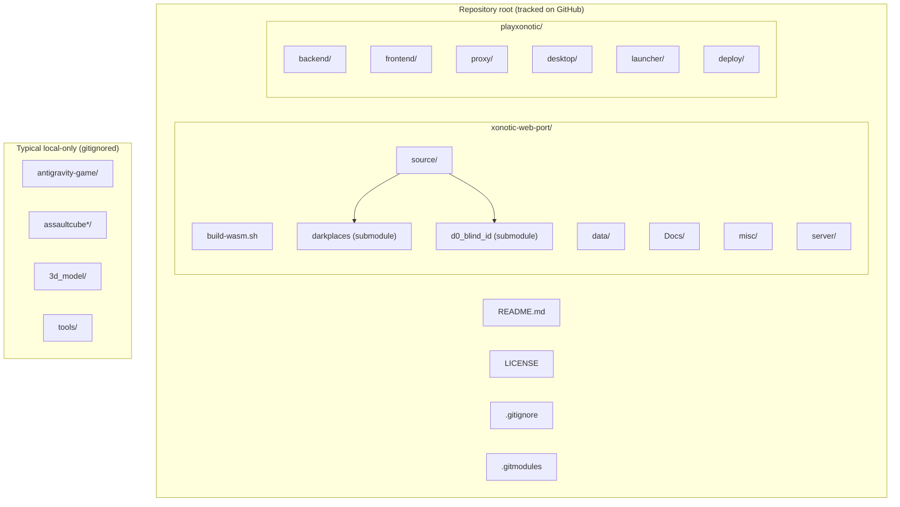
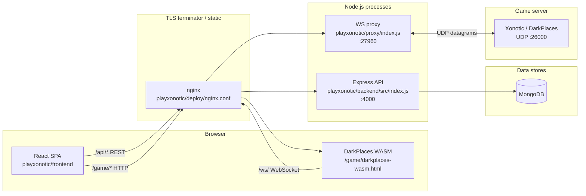
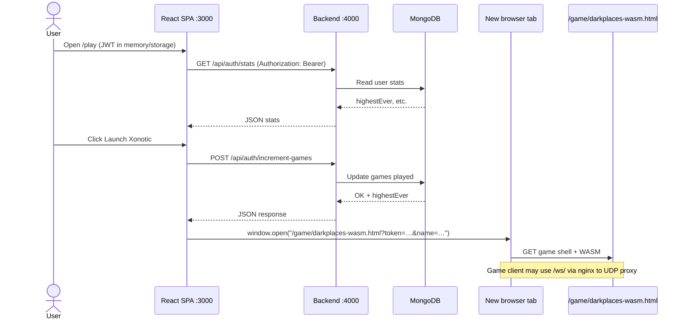
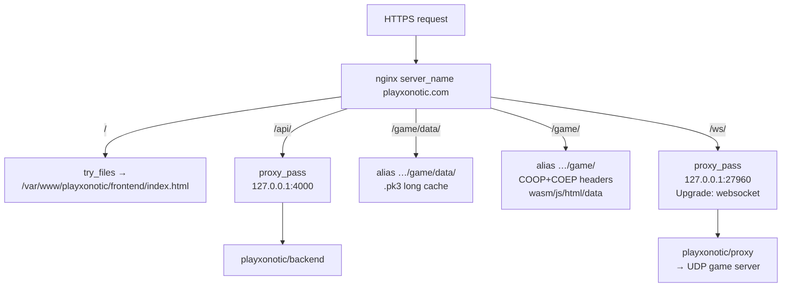

# PlayXonotic + Xonotic WebAssembly

This monorepo combines **PlayXonotic** (web app, API, desktop shell, WebSocket bridge, deployment assets) with **`xonotic-web-port/`** (upstream-style Xonotic tree plus **DarkPlaces** built for **WebAssembly** via Emscripten). Paths below are **relative to the repository root** unless stated otherwise.

Other directories you may have beside this clone (for example `antigravity-game/`, `assaultcube/`, `tools/`) are **intentionally gitignored**—they stay on your machine only. See [.gitignore](.gitignore).

---

## Table of contents

1. [Repository map (Mermaid)](#1-repository-map-mermaid)
2. [Tracked paths — quick index](#2-tracked-paths--quick-index)
3. [Root files](#3-root-files)
4. [`xonotic-web-port/` — Xonotic + WASM engine](#4-xonotic-web-port--xonotic--wasm-engine)
5. [`playxonotic/` — application stack](#5-playxonotic--application-stack)
6. [Runtime architecture (Mermaid)](#6-runtime-architecture-mermaid)
7. [Xonotic WASM build pipeline (Mermaid)](#7-xonotic-wasm-build-pipeline-mermaid)
8. [Authentication and launch flow (Mermaid sequence)](#8-authentication-and-launch-flow-mermaid-sequence)
9. [Production nginx routing (Mermaid)](#9-production-nginx-routing-mermaid)
10. [Clone, submodules, and local development](#10-clone-submodules-and-local-development)
11. [Environment variables](#11-environment-variables)
12. [License](#12-license)

---

## 1. Repository map (Mermaid)

High-level view of **what this GitHub repository contains** versus **local-only** siblings.



*(The bottom group is **not** inside the Git repository: those folders often sit next to the clone on disk but are listed in `.gitignore`.)*

---

## 2. Tracked paths — quick index

| Path | Role |
|------|------|
| `README.md` | This document |
| `LICENSE` | Root GPLv2-style notice |
| `.gitignore` | Keeps non–Xonotic/PlayXonotic trees out of Git |
| `.gitmodules` | Submodule URLs for DarkPlaces and `d0_blind_id` |
| `xonotic-web-port/` | Xonotic packaging, data, docs, scripts, WASM build |
| `xonotic-web-port/source/darkplaces` | Submodule: engine sources (`emmake make emscripten-standalone`) |
| `xonotic-web-port/source/d0_blind_id` | Submodule: crypto support library |
| `playxonotic/backend/` | Express + MongoDB API |
| `playxonotic/frontend/` | Vite + React + Tailwind SPA |
| `playxonotic/proxy/` | Node `ws` server: WebSocket ↔ UDP to game server |
| `playxonotic/desktop/` | Electron (Electron Forge) wrapper |
| `playxonotic/launcher/` | Optional Rust + GTK4 native launcher |
| `playxonotic/deploy/` | `nginx.conf`, VPS scripts |

---

## 3. Root files

| File | Purpose |
|------|---------|
| `README.md` | Project documentation |
| `LICENSE` | License text for this packaging; engine/game have additional terms under `xonotic-web-port/` |
| `.gitignore` | Excludes build artifacts, secrets, `node_modules/`, and unrelated local projects |
| `.gitmodules` | Records submodule paths and clone URLs |

---

## 4. `xonotic-web-port/` — Xonotic + WASM engine

This tree mirrors a **Xonotic** source layout (upstream home: [GitLab Xonotic](https://gitlab.com/xonotic/xonotic)). Important **paths**:

| Path | Description |
|------|-------------|
| `xonotic-web-port/build-wasm.sh` | **Entry script** for Emscripten: sets `CC=emcc`, `EM_CACHE=./emscripten_cache`, disables heavy engine links, runs `emmake make emscripten-standalone` inside the engine |
| `xonotic-web-port/Makefile` | Top-level Xonotic make orchestration (non-WASM builds, packaging helpers) |
| `xonotic-web-port/CMakeLists.txt` | CMake metadata used by parts of the upstream tree |
| `xonotic-web-port/data/` | Game data pk3dir-style trees (fonts, etc.); see `xonotic-web-port/data/.gitignore` |
| `xonotic-web-port/Docs/` | Upstream documentation (`faq.md`, `guide.md`, mapping notes, assets) |
| `xonotic-web-port/misc/` | Branding, build files, logos, infrastructure scripts |
| `xonotic-web-port/server/` | Example dedicated-server configs, `rcon` tooling |
| `xonotic-web-port/source/darkplaces` | **Git submodule** → DarkPlaces; WASM build runs from `xonotic-web-port/source/darkplaces/` |
| `xonotic-web-port/source/d0_blind_id` | **Git submodule** → blind-ID crypto library |
| `xonotic-web-port/COPYING`, `GPL-2`, `GPL-3` | Upstream licensing text |
| `xonotic-web-port/README.md` | Upstream Xonotic readme |
| `xonotic-web-port/CONTRIBUTING.md` | Upstream contribution guidelines |

### WASM build: working directories and artifacts

The script `xonotic-web-port/build-wasm.sh`:

1. Exports Emscripten toolchain variables and `EM_CACHE` → **`xonotic-web-port/emscripten_cache/`** (ignored by Git).
2. `cd` to **`xonotic-web-port/source/darkplaces`**.
3. Invokes **`emmake make emscripten-standalone`** with `DP_MAKE_TARGET=wasm` and several `DP_LINK_*` overrides.

**Ignored / generated** (typical; see root `.gitignore`):

- `xonotic-web-port/emscripten_cache/`
- `xonotic-web-port/emscripten_config` (if created)
- `xonotic-web-port/source/darkplaces/build-obj/`
- `xonotic-web-port/source/darkplaces/*.html`, `*.js`, `*.wasm`, `*.data` (runtime loadables)

After a successful build, you deploy or symlink the HTML/JS/WASM/data bundle so the browser can open something like **`/game/darkplaces-wasm.html`** (see Play page below).

---

## 5. `playxonotic/` — application stack

### 5.1 Frontend — `playxonotic/frontend/`

| Path | Description |
|------|-------------|
| `playxonotic/frontend/package.json` | Scripts: `dev` (Vite), `build`, `lint`, `preview` |
| `playxonotic/frontend/vite.config.js` | Dev server **port 3000**; proxies **`/api` → `http://localhost:4000`** |
| `playxonotic/frontend/index.html` | SPA shell |
| `playxonotic/frontend/src/main.jsx` | React entry |
| `playxonotic/frontend/src/App.jsx` | Routes: `/`, `/login`, `/signup`, `/play` |
| `playxonotic/frontend/src/context/AuthContext.jsx` | JWT / user session handling |
| `playxonotic/frontend/src/components/Navbar.jsx` | Navigation |
| `playxonotic/frontend/src/pages/Home.jsx` | Landing |
| `playxonotic/frontend/src/pages/Login.jsx` | Sign-in |
| `playxonotic/frontend/src/pages/Signup.jsx` | Registration |
| `playxonotic/frontend/src/pages/Play.jsx` | Authenticated “launch”; opens **`/game/darkplaces-wasm.html?token=…&name=…`** in a new tab |
| `playxonotic/frontend/public/` | Static assets (e.g. `vite.svg`) |

**Build output:** `playxonotic/frontend/dist/` — **gitignored**; produce with `npm run build`.

### 5.2 Backend — `playxonotic/backend/`

| Path | Description |
|------|-------------|
| `playxonotic/backend/package.json` | `start` / `dev` run `src/index.js` |
| `playxonotic/backend/.env.example` | Template for `PORT`, MongoDB, JWT, CORS origin |
| `playxonotic/backend/src/index.js` | Express app: helmet, CORS, JSON body, rate limit on **`/api/auth`**, mounts routes, **`GET /api/health`** |
| `playxonotic/backend/src/config/db.js` | MongoDB connection |
| `playxonotic/backend/src/middleware/auth.js` | JWT verification helper |
| `playxonotic/backend/src/routes/auth.js` | Auth + stats endpoints (used by `Play.jsx`) |
| `playxonotic/backend/src/routes/save.js` | Save-game related API |
| `playxonotic/backend/src/models/User.js` | User model |
| `playxonotic/backend/src/models/Save.js` | Save model |

Default **listen**: `PORT` or **4000**. CORS origin: `FRONTEND_URL` or `http://localhost:3000`.

### 5.3 WebSocket ↔ UDP proxy — `playxonotic/proxy/`

| Path | Description |
|------|-------------|
| `playxonotic/proxy/package.json` | `start` → `node index.js` |
| `playxonotic/proxy/.env.example` | `WS_PORT`, `GAME_SERVER_HOST`, `GAME_SERVER_PORT` |
| `playxonotic/proxy/index.js` | **`WebSocketServer`** on `WS_PORT` (default **27960**); per client opens **UDP** to **`GAME_SERVER_HOST:GAME_SERVER_PORT`** (default **127.0.0.1:26000**); forwards binary both ways |

### 5.4 Desktop — `playxonotic/desktop/`

| Path | Description |
|------|-------------|
| `playxonotic/desktop/package.json` | Electron app; Forge `package` / `make` |
| `playxonotic/desktop/main.js` | Main process |
| `playxonotic/desktop/preload.js` | Preload bridge |
| `playxonotic/desktop/login.html` | Login UI for desktop |
| `playxonotic/desktop/forge.config.js` | Electron Forge makers (deb, dmg, zip, etc.) |
| `playxonotic/desktop/game/` | Placeholder for bundled game assets (`.gitkeep`) |
| `playxonotic/desktop/icons/` | Icon placeholders |

**Ignored:** `playxonotic/desktop/out/`, `playxonotic/desktop/node_modules/`.

### 5.5 Native launcher — `playxonotic/launcher/`

| Path | Description |
|------|-------------|
| `playxonotic/launcher/Cargo.toml` | Crate **`playxonotic-launcher`** — GTK4, `reqwest`, zip extraction |
| `playxonotic/launcher/src/main.rs` | Entry |
| `playxonotic/launcher/src/app.rs` | Application logic |
| `playxonotic/launcher/src/ui.rs` | GTK UI |
| `playxonotic/launcher/src/auth.rs` | Auth against your API |
| `playxonotic/launcher/src/game.rs` | Game download / run integration |
| `playxonotic/launcher/build-deb.sh` | Debian package helper |
| `playxonotic/launcher/debian/control` | Package metadata |
| `playxonotic/launcher/testpkg/` | Test packaging tree |

**Ignored:** `playxonotic/launcher/target/` (Rust build tree).

### 5.6 Deployment — `playxonotic/deploy/`

| Path | Description |
|------|-------------|
| `playxonotic/deploy/nginx.conf` | TLS, SPA root, **`/api/`** → backend, **`/game/`** static WASM + COOP/COEP headers, **`/game/data/`** for `.pk3`, **`/ws/`** → WebSocket proxy |
| `playxonotic/deploy/deploy.sh` | Deployment automation (server-side) |
| `playxonotic/deploy/setup-vps.sh` | VPS bootstrap |

---

## 6. Runtime architecture (Mermaid)

Logical components and protocols (production-style; ports match defaults in code and examples).



**Development** (without nginx): Vite serves the SPA on **:3000** and proxies only **`/api`** to **:4000**. Serving **`/game`** and **`/ws`** locally may require extra proxy rules or running the built frontend behind nginx—match paths to `deploy/nginx.conf` for parity.

---

## 7. Xonotic WASM build pipeline (Mermaid)

```mermaid
flowchart TD
  A["Developer runs\nxonotic-web-port/build-wasm.sh"] --> B["Export emcc, EM_CACHE,\nDP_LINK_* overrides"]
  B --> C["cd xonotic-web-port/source/darkplaces"]
  C --> D["make clean"]
  D --> E["emmake make emscripten-standalone\ndebug=1, wasm target"]
  E --> F["Artifacts under\nxonotic-web-port/source/darkplaces/\nbuild-obj/release/ …"]
  F --> G["Copy or symlink HTML/JS/WASM/.data\nto web root /game/\n(see deploy/nginx.conf)"]
  G --> H["Browser loads\n/game/darkplaces-wasm.html"]
```



---

## 8. Authentication and launch flow (Mermaid sequence)

Simplified sequence for a logged-in user hitting **Launch** on `/play` (`playxonotic/frontend/src/pages/Play.jsx`).



---

## 9. Production nginx routing (Mermaid)

Derived from `playxonotic/deploy/nginx.conf` (paths on disk there are examples—adjust to your server).



**Security / performance notes** (from the same config):

- **`Cross-Origin-Opener-Policy: same-origin`** and **`Cross-Origin-Embedder-Policy: require-corp`** on `/game/` support **SharedArrayBuffer** for threaded WASM.
- **gzip_static** / **gzip** tuned for **`.wasm`** and **`.js`**.
- Explicit **`types`** for `html`, `js`, `wasm`, `data`, `pk3`.

---

## 10. Clone, submodules, and local development

### Clone with submodules

```bash
git clone --recurse-submodules git@github.com:barramee27/playxonotic.git
cd <your-clone-directory>
```

If you already cloned without submodules:

```bash
git submodule update --init --recursive
```

Submodule paths (from `.gitmodules`):

- `xonotic-web-port/source/darkplaces` → `https://github.com/xonotic/darkplaces.git`
- `xonotic-web-port/source/d0_blind_id` → `https://github.com/xonotic/d0_blind_id.git`

### WASM build

```bash
cd xonotic-web-port
./build-wasm.sh
```

Requires **Emscripten** (`emcc`, `em++`, `emmake`) and build tools expected by DarkPlaces.

### PlayXonotic — typical local commands

```bash
# Terminal 1 — API
cd playxonotic/backend
cp .env.example .env   # edit values
npm install
npm run dev

# Terminal 2 — frontend
cd playxonotic/frontend
npm install
npm run dev
# Open http://localhost:3000

# Terminal 3 — WebSocket ↔ UDP proxy (when testing multiplayer / net path)
cd playxonotic/proxy
cp .env.example .env   # edit if needed
npm install
npm start
```

**Desktop:**

```bash
cd playxonotic/desktop
npm install
npm start
```

**Rust launcher:**

```bash
cd playxonotic/launcher
cargo build --release
```

---

## 11. Environment variables

### `playxonotic/backend/.env` (from `.env.example`)

| Variable | Example | Purpose |
|----------|---------|---------|
| `PORT` | `4000` | HTTP listen port |
| `MONGODB_URI` | `mongodb+srv://…` | MongoDB connection string |
| `JWT_SECRET` | long random string | Signs JWTs |
| `FRONTEND_URL` | `http://localhost:3000` | CORS allowed origin |

### `playxonotic/proxy/.env` (from `.env.example`)

| Variable | Default | Purpose |
|----------|---------|---------|
| `WS_PORT` | `27960` | WebSocket listen port |
| `GAME_SERVER_HOST` | `127.0.0.1` | UDP game server host |
| `GAME_SERVER_PORT` | `26000` | UDP game server port |

Never commit real `.env` files; they are ignored by `.gitignore`.

---

## 12. License

- Root [`LICENSE`](LICENSE) — GPLv2-aligned notice for this packaging.
- **`xonotic-web-port/`** — see **`COPYING`**, **`GPL-2`**, **`GPL-3`**, and upstream **`README.md`** / **`CONTRIBUTING.md`**.
- **PlayXonotic** — Node and Rust components declare licenses in `package.json` / `Cargo.toml` (e.g. **ISC** for some Node packages); verify per package when redistributing.
